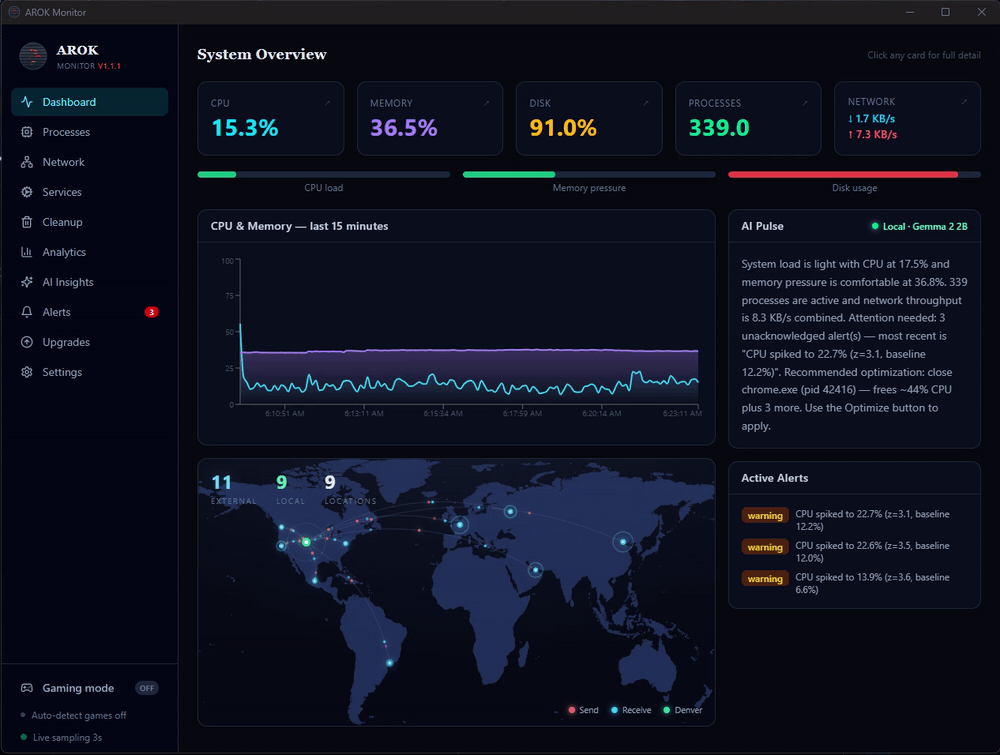

<div align="center">


# AROK Monitor

**The system monitor that explains itself.**

AROK watches your Windows PC, detects anomalies deterministically, and uses a local AI to narrate what's happening in plain English — 100% on your machine. No cloud, no telemetry, no account.

[](https://github.com/srwim/AROK-monitor/releases/latest)
[](https://github.com/srwim/AROK-monitor/releases)
[](LICENSE)


**[⬇ Download the latest installer](https://github.com/srwim/AROK-monitor/releases/latest)**



<!-- Still version for listings / social previews: docs/screenshots/dashboard.png -->

</div>

---

## Why AROK?

- **It explains, it doesn't just graph.** Every monitor shows you a CPU line. AROK's local AI turns deterministic findings into plain English: *"Chrome has been climbing for 20 minutes and is now using 40% CPU — unusual for this time of day."* Detection is never delegated to the model, so it's exact; the AI only narrates.
- **100% local and private.** Metrics, history, and AI inference all stay on your machine. Works fully offline. Open source (MIT), no account, no telemetry, no ads.
- **Free.** AROK is monetized only by optional, clearly-disclosed Amazon affiliate links in the Hardware Upgrades tab — if you never open that tab, AROK costs nothing and sells nothing.

## What's inside

Nine tabs, all live against the local backend: **Dashboard · Processes · Network · Services · Cleanup · Analytics · AI Insights · Upgrades · Settings**, plus a global **Gaming mode** toggle (with auto-detect).

- **Dashboard** — live CPU/memory/disk/network/process cards with drill-down detail, the AI Pulse narrative, the animated world map of your network connections, and (when Chat with AI is on) an inline chat panel right under the Pulse.
- **Network** — a geographic world map that resolves external connections and animates traffic between you and each endpoint, above a live connections table. Every connection is scored with transparent, deterministic heuristics (port reputation, process location, unknown owners, public-interface listeners); click **Investigate** on any endpoint for a drill-down of why it was flagged, and flag it **safe** to exclude it from future suspicion.
- **Analytics** — resource-trend graphs with spike-cause markers: click a marker to pin that moment and drill into the per-process snapshot that caused it, with the anomaly-alert table and event log right below.
- **AI Insights** — the narrator: anomaly findings, plain-English system story, one-click optimization recommendations, a compact **Model Selection** dropdown for the local engine, and a **Chat with AI** panel for talking directly to the active engine (persisted toggle, also switchable in Settings; the chat rides the Dashboard too).
- **Sensors** — SMART drive health, wear and temperatures feed both the alerting and the upgrade advice; a failing disk tells you to back up *before* it dies.
- **Cleanup** — temp-file cleaner, conservative registry cleaner (restore point + `.reg` backup first), and a guided, checksum-verified Tron launcher.
- **Upgrade Advisor** — diagnosis-led recommendations from your own telemetry: findings like "storage 91% full" or "drive at 85% wear" rank what's actually worth upgrading, with picks matched to your CPU socket and memory generation so nothing incompatible is ever suggested. Plus priced full builds and an RTX 50-series GPU watch, refreshed daily. *Affiliate-funded — every link is tagged and FTC-disclosed.*
- **Settings** — runtime settings, run-on-startup toggle, offline Ed25519 licensing, and quiet background auto-updates: new releases download and verify silently, then a one-click "Relaunch to update" pill applies them — no wizard, no UAC.

## Real local AI

Pick your model in-app: a curated menu of six open-source GGUFs (Qwen 2.5 1.5B → Mistral 7B, each with parameter count and download size; Gemma 2 2B is the default) — or point AROK at a GGUF you already have on disk. After download, narration and chat run entirely offline (`pip install -r backend\requirements-ai.txt` for inference support). Engine priority: **local model → Anthropic Cloud (optional, bring your own key) → deterministic template**. Without any AI configured, narration falls back to templates — the app always works.

## Install

**Users:** grab the installer from [Releases](https://github.com/srwim/AROK-monitor/releases/latest) and run it.

**From source (Windows):**

1. `run_demo.bat` — creates a venv, installs deps, serves at `http://127.0.0.1:8420` (legacy console immediately).
2. `build_frontend.bat` (Node 18+) — builds the React UI; restart `run_demo.bat` to serve it.

Other launchers: `run_desktop.bat` (native pywebview/WebView2 window, system tray) · `make_installer.bat` (React build → PyInstaller → Inno Setup installer, needs Inno Setup 6).

React dev with hot reload: `cd frontend && npm run dev` (proxies `/api` and `/ws` to port 8420). `tsc -b` is the authoritative frontend correctness check.

## Security model

- The server binds to `127.0.0.1` only.
- All requests must carry a localhost `Host`/`Origin` (blocks DNS rebinding); all state-changing API calls require a per-session token (blocks cross-site request forgery from malicious pages).
- Control actions (kill process, block IP, stop service) can run in **demo mode** (`AROK_DEMO=1`): simulated and logged, never executed.
- Licensing is offline Ed25519 — generate keys with `python backend\generate_license.py` on a trusted machine; never ship `license_private.pem`. Unlicensed installs run as **Personal Use** with full functionality.

## Environment flags

| Variable | Default | Effect |
|---|---|---|
| `AROK_DEMO` | `0` | `0` = control actions execute for real. `1` = simulated and logged. Editable at runtime in Settings. |
| `AROK_MODEL_URL` | unset | Override the local-model GGUF download URL (defaults to a public Gemma 2 2B Q4). |
| `AROK_ANTHROPIC_KEY` | unset | Anthropic API key for cloud narration. |
| `AROK_REPO` | `srwim/AROK-monitor` | GitHub repo for update checks. |
| `AROK_DB` | `backend/arok.db` | SQLite path. |

## Architecture notes

- **LLM narrator pattern** — `monitor.py` detects everything deterministically (z-score over a 60-sample window + absolute-threshold safety net for flat baselines); `ai.py` only turns findings into prose.
- **Dual serving** — `main.py` serves `frontend/dist/` when built, falls back to `backend/index.html` otherwise.
- **Demo-safe controls** — every control endpoint logs to the event log; in demo mode nothing is executed.
- **Affiliate manifest** — tagged Amazon links generated by `upgrades-pipeline/build_manifest.py`; a daily GitHub Action refreshes `manifest.json`, with a bundled fallback at `frontend/public/manifest.json`. Search-URL links, so they never go stale or 404.

## Files

```
backend/   main.py · monitor.py · netsec.py · sensors.py · db.py · ai.py · control.py · hardware.py · cleanup.py
           optimizer.py · licensing.py · updater.py · autostart.py · desktop.py · arok.spec · requirements*.txt
frontend/  Vite + React + TS + Tailwind v4 · src/tabs/ (9 tabs) · src/components/ (ui.tsx, NetworkMap.tsx) · src/geo.ts
upgrades-pipeline/  build_manifest.py · affiliate.py · icecat.py · parts_catalog.json · manifest.json
scripts/   bump_version.py · release_summary.py · preflight_pipeline.py
```

## License

MIT — see [LICENSE](LICENSE).

*As an Amazon Associate, this project earns from qualifying purchases made through links in the Hardware Upgrades tab.*
